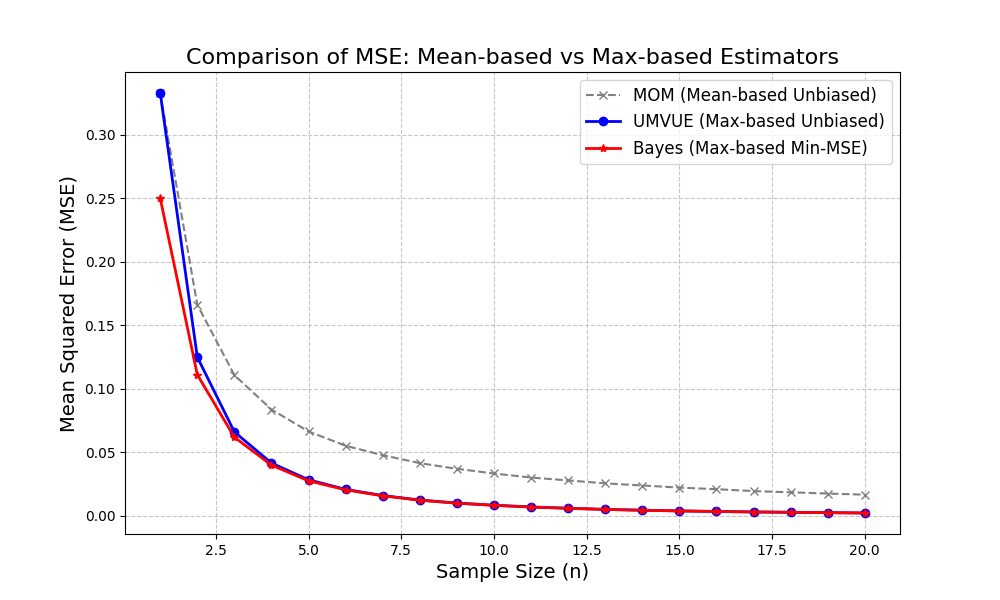

# Estimator Sim: Verification of MSE vs Unbiasedness

**Comparison of Mean-based vs Max-based Estimators via Monte Carlo Simulation.**

## 📖 Overview
大学時代の専攻である「数理統計学」における推定量の性質（不偏性とMSEのトレードオフ）を、C++を用いたモンテカルロ・シミュレーションによって数値的に検証したプロジェクトです。

一様分布 $U(0, \theta)$ において、以下の3つの推定量の精度（MSE: 平均二乗誤差）を比較しました。

1. **MOM (Method of Moments)**: 平均値ベースの不偏推定量
2. **Bayes (Min-MSE)**: 最大値ベースの推定量（バイアスあり、MSE最小）
3. **UMVUE**: 最大値ベースの不偏推定量

## 📊 Result
シミュレーションの結果、**「不偏性（偏りがないこと）」を犠牲にしてでも、バイアスを受け入れた方がMSE（トータルの誤差）を小さくできる**ことを実証しました。



* **Gray (MOM)**: 平均値ベースは収束が遅く、精度が低い。
* **Blue (UMVUE)**: 最大値を使うことで劇的に改善するが、まだ改善の余地がある。
* **Red (Bayes)**: バイアスを受け入れることで、最もMSEが小さい推定量となる。

## 🛠 Tech Stack & Optimizations
数値計算の信頼性と速度を担保するため、以下の技術選定を行いました。

* **Language**: C++11 (Simulation), Python (Visualization)
* **Random Engine**: `std::mt19937` (Mersenne Twister)
    * `rand()` の周期性や偏りを回避し、数学的な厳密性を担保。
* **Precision**: Full `double` precision to avoid integer division errors.
* **Optimization**:
    * メモリ割り当て（`std::vector`）のオーバーヘッドを排除し、ストリーム処理による $O(N)$ の計算ロジックを実装。
    * Compiler optimization flag `-O3` enabled in Makefile.

## 🚀 Usage

### 1. Build & Run Simulation (C++)
```bash
make
./estimator
# Input: theta K max_n
# Example: 1.0 100000 20# Estimator-Sim
